# sysretq0

> Systems programming & Linux kernel internals (`ring0` ⇄ `ring3`)

Focusing on custom Android/GKI infrastructure, Linux Security Modules (LSM), and hyper-optimized userspace daemons in Rust & C.

---

### Stats

  
  

---

### Verification
All commits are signed with GPG:
`97DE 60E3 277B 381B FECA  EE58 628B C9E3 2379 DF41`
